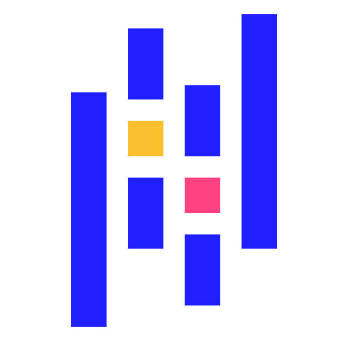
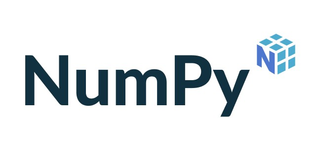
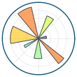
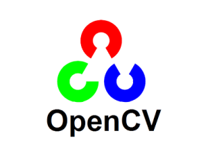
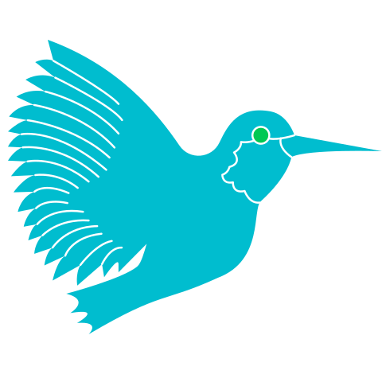
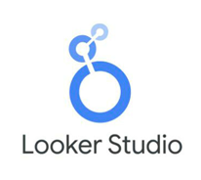

<h1 align="center">Hi 👋, I'm Tran Hoang Long</h1>
<h3 align="center">I'm a data analyst with a strong passion for statistical and regression analysis. Alongside my main role, I also work as an AI engineer and web developer, exploring ways to apply machine learning and web technologies to real-world problems.</h3>

- 📫 How to reach me **golderalex6@gmail.com**

<h3 align="left"><b><ins>TECHNICAL SKILLS</ins></b></h3>
<ul>
  <li><b> Programming language : </b>  </li>
  <li><b> Databases : </b>   </li>
  <li><b> Data processing : </b>   </li>
  <li><b> Data visualization : </b> </b>  </li>
  <li><b> A.I\Machine Learning : </b>  </li>
  <li><b> Computer vision : </b>   </li>
</ul>

<h3 align="left"><b>SECONDARY SKILLS </b></h3>
<ul>
  <li><b> Report : </b>    </li>
  <li><b> Version control : </b>   </li>
  <li><b> Operating system : </b>   </li>
  <li><b> Devops :  </b>  </li>
</ul>
